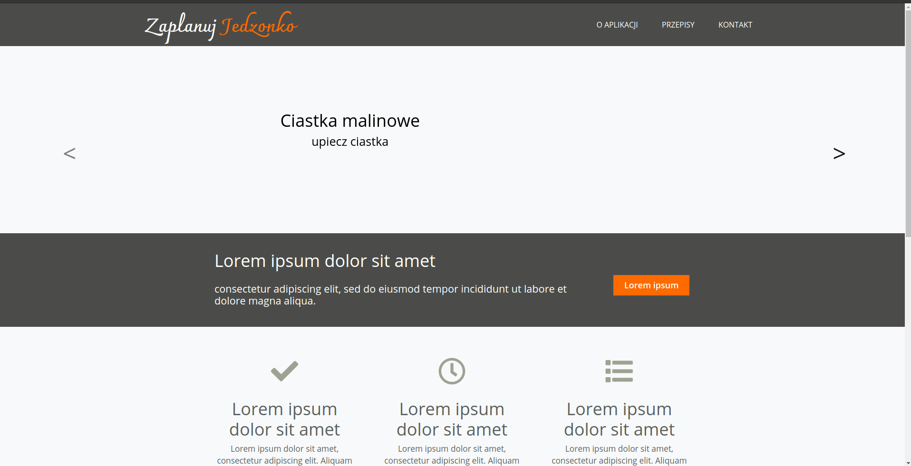
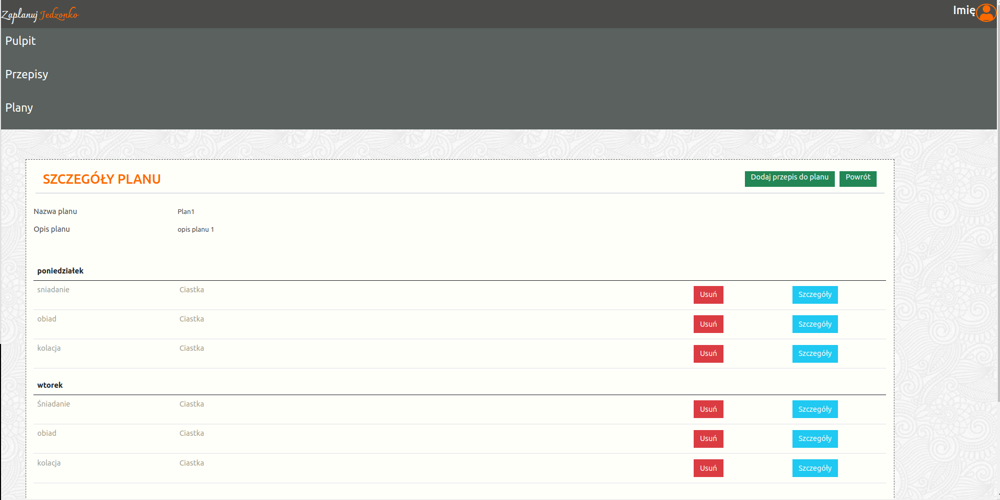
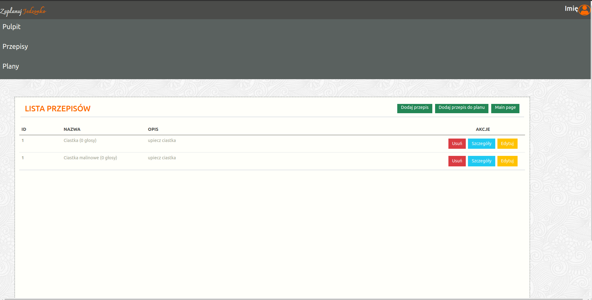

# food_app
Application that allows users to add recipes, vote on them and create weekly dietary plans

## technologies:
* Python 3.8
* Django 3.1.7
* Bootstrap 4
* Javascript
* REST

### Application supports following functionalities:
* adding recipes
* counting nutrition values
* creating dietary plans
* voting on recipes

### Project status: ongoing

